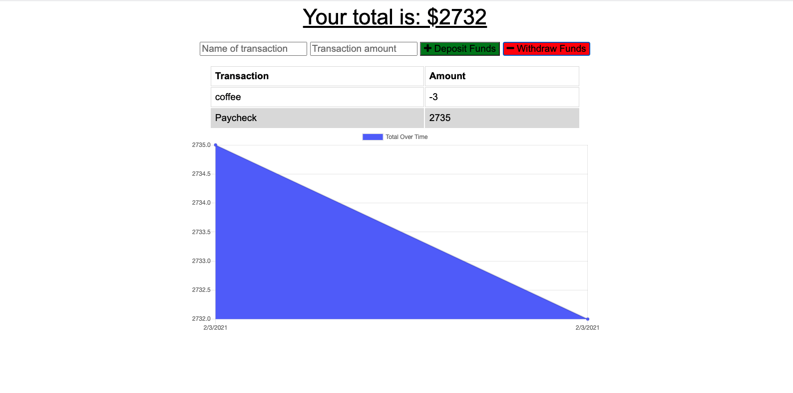

# Budget Tracker 

## Discription

This is an offline/online installable PWA that tracks deposits and expenditures.

## Table of Contents

- [Installation](#Installation)
- [Installation](#Installation)
- [Usage](#Usage)
- [License](#License)
- [Contributing](#Contributing)
- [Tests](#Tests)
- [Questions](#Questions)

## Installation

You can fork repository and use npm start or you can go to the site by pressing this [Link](https://sleepy-retreat-09837.herokuapp.com/)

## Usage

## License

MIT

## Contributing

Allan Bramley

## Tests

End to End

## Questions

[chefbrams](https://github.com/chefbrams)

Contact me by email with any further questions.

abwebdev358@gmail.com
